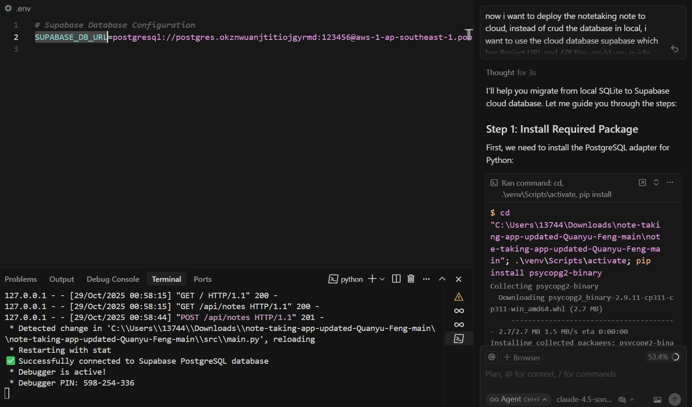
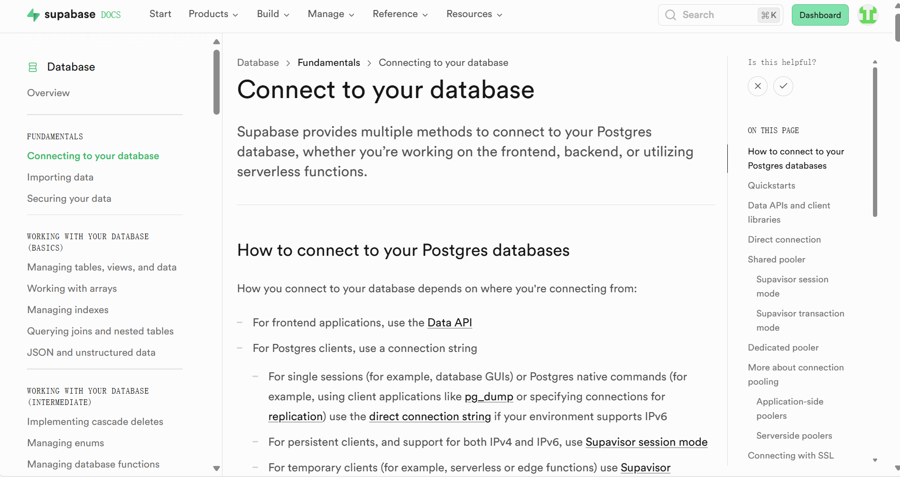
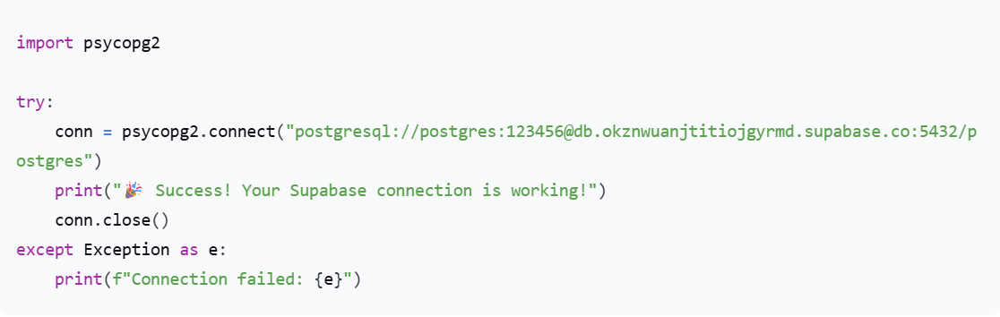
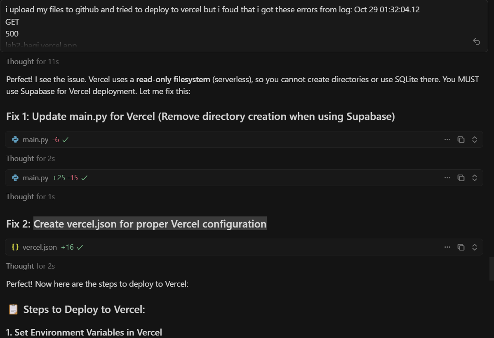
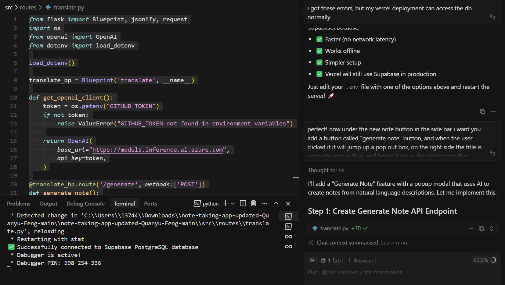
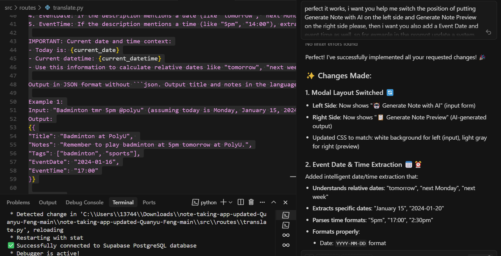

# Project Reflection: Note-Taking App

## Bugs Fixed

### UI/UX Improvements
- **Fixed size elements**: Note list and note context box now have a fixed size
- **Title character limit**: Added validation for long titles without spaces
- **Long title display**: Improved display of long titles in the note list
- **Content formatting**: Fixed issue where multiple lines were combined - now properly separated
- **Horizontal scroll**: Removed unnecessary horizontal scroll bar
- **Save confirmation**: Added prompt asking users to save when starting a new note
- **Delete button timing**: Delete buttons now show only after user saves the note
- **Save button state**: Save button is disabled until there are new changes to the note

## New Features Implemented

### Core Features
- **Tags system**: Added comma-separated tags for note organization
- **Event scheduling**: Added event date and event time fields
- **AI translation**: Integrated AI translate button that can translate the title and the context into select language
- **AI note generation**: Smart note generation that understands temporal context (like "tomorrow") and automatically updates event dates and times

## Technical Challenges & Solutions

### Cloud Database Integration
**Challenge**: Refactor the app to store data in an external database  
**How I solve the Challenge**:
- I use the agent mode in cursor to help me modify the code to use the Supabase cloud database, which guides me step by step to use the cloud database. I met several problems such as how to use the SUPABASE_DB_URL, in order to get the SUPABASE_DB_URL i read through the supabase document and tried many attempts to use the url finally i got everything set up.
- Here is the screenshot that i asked the cursor to help me modify the project to use the cloud database: 
- Here is the supbase cloud database documents i read:
- Here is the connection test i tried to connect with the supabase:

### Vercel Deployment
**Challenge**: Refactor app structure for successful deployment on Vercel cloud platform  
**How I solve the Challenge**:
- The Vercel uses a read-only filesystem (serverless), so i cannot create directories or use SQLite there, thus i Update main.py for Vercel (Remove directory creation when using Supabase) and Create vercel.json for proper Vercel configuration:
- Removed directory creation and SQLite dependencies
- Updated `main.py` to work with Supabase without local file operations
- Created proper `vercel.json` configuration file

### AI Integration
**Challenge**: Implement LLM model for new AI features  
**How I solve the Challenge**:
- I followed the lab instructions and easily deployed the github ai through the github token, then I used cursor to help me add a translate button and generate a note button by using the ai model. And also the AI model can understand what is the date of tomorrow:, 

## Lessons Learned
1. I learned how to use the ai model to help me generate a full stack project step by step, and describe the bug and issue to let the ai model solve the problems.
2. I learned how to deploy a project with a cloud database and a model api, which is a very helpful lesson that helps me know how to develop and publish a project.
3. I learned how to write a Markdown file and insert images into it
